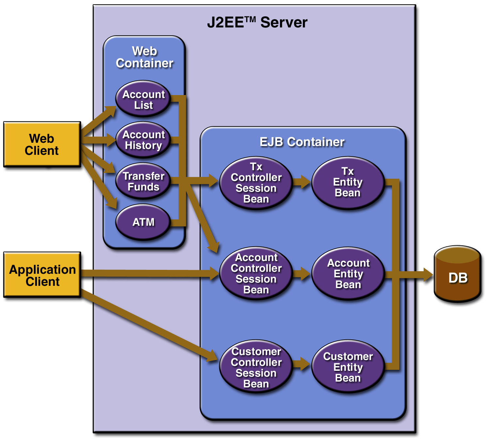
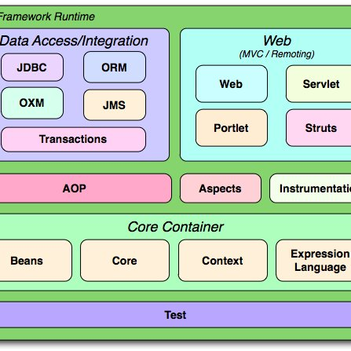

# 스프링 소개

## 스프링을 쓰는 이유(현실적인 이유?)
* 돈
* 전자정부프레임워크
* 자바

## 스프링프레임워크
* JavaEE development without EJB (2004. Rod Johnson)

* Inversion of Control
* Dependcy Injection
* Aspect Oriented Programming
* Portable Service Abstractions

* pojo: 어디에 의존하지않는 오브젝트
  

## Plain Object
* Plain Old Java Object
* HttpServlet 과는 다름

## IoC / DI
* 사용할 객체를 외부에서 주입
* 생성자의 인자 setter 메서드
* Strategy Pattern
* 플러그인 만들기 좋음
* Interface 준수
* 테스트 객체로, 주입 객체 바꿔치기
  
## PSA
* 포터블 서비스 추상화
* 환경에 종속되지 않도록 유연한 추상 계층

## AOP
* 로깅, 트랜잭션과 같이 산재된 코드 모듈화
* 모듈화
  
## J2EE

* 분산환경에서 객체를 전달

## Spring Architecture

* bean : POJO 객체를 관리
* core : bean 관리
* context : bean factory에서 빈을 생성
* Instrumentation : 클래스의 재구성
* jms : java messaging service
* struts : mvc  

## Why Spring
* Modularity : POJO 
* 생산성
* Portability : 톰캣, JavaEE, Cloud
* Testability 