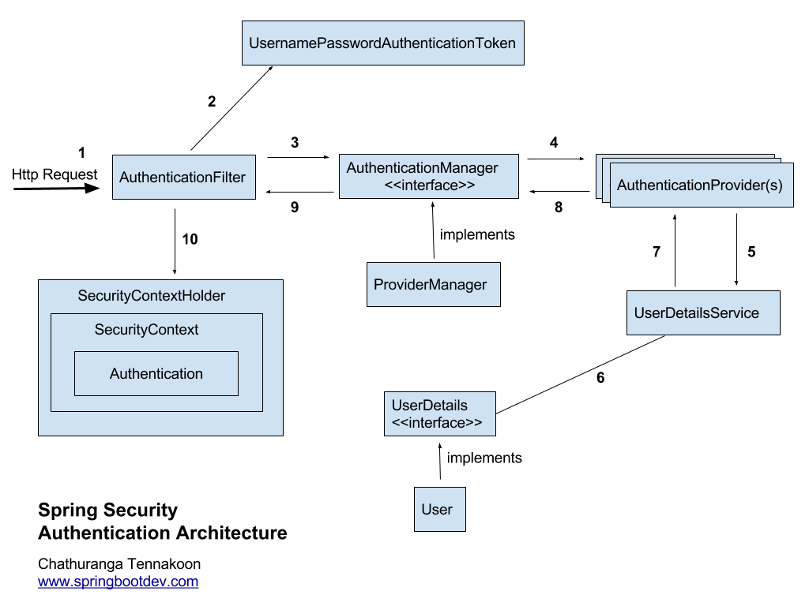

Spring Securit
===========================

## 1. 스프링 시큐리티

### 01. 스프링 스프링 시큐리티란

* Spring Framework 기반 인증, 권한 프레임워크
* 구현은 Servlet Filter 및 Spring AOP 기반 
* 비지니스 로직과 인증, 권한 로직을 분리


### 02. 인증, 권한

* 인증 authentication : 어떤 서비스나 기능을 사용하기 위해 정당한 사람임이 확인하는 절차
* 권한 Authorization :  누군가에게, 권리, 행위가 미치는 범위
* 유저 Principal : 현재 로그인한 유저




* HTTP REQUEST 기반의 인증.
* 유저의 정보 user, password를 기반으로 UsernamePasswordAuthenticationToken생성
* AuthenticationManager를 통해 AuthenticationProvider를 실행된다. 
* UserDetailService를 통해 username기반의 정보를 가져온다. 
* UserDetail은 다양한 생성된 유저정보를 추상화 한 객체이다. 
* 인증이 성공적으로 진행되었다면 Authentication object가 생성된다. 
* 인증에 실패했다면 AuthenticationException 발생. 

[Security Example]: https://spring.io/guides/gs/securing-web/ 


### 인메모리 인증
```@Bean
public UserDetailsService userDetailsService() throws Exception {
	InMemoryUserDetailsManager manager = new InMemoryUserDetailsManager();
	manager.createUser(User.withUsername("user").password("password").roles("USER").build());
	manager.createUser(User.withUsername("admin").password("password").roles("USER","ADMIN").build());
	return manager;
}
```

* AuthenticationManagerBuilder를 사용해서 인증 객체를 만들수 있다. AuthenticationManagerBuilder를 메소드를 통해 주입


